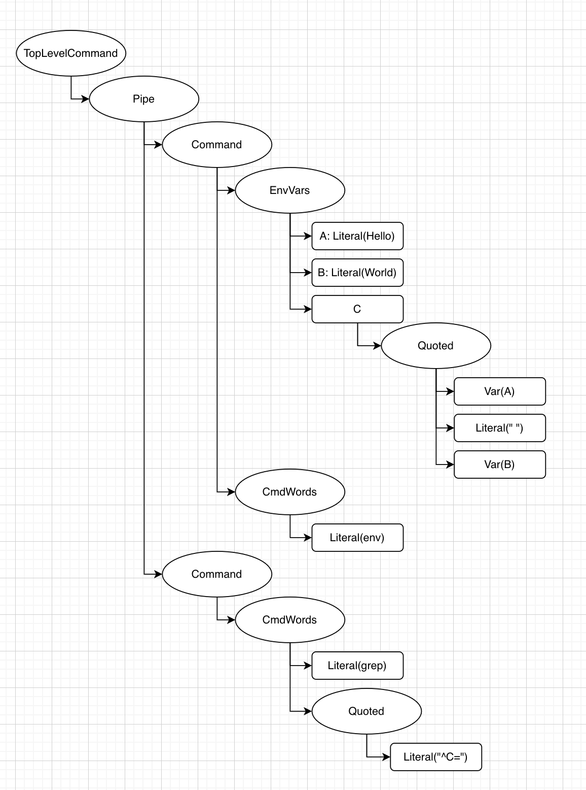

# Архитектура Shell

## Требования

### Функциональные

Необходимо реализовать интерпретатор командной строки с поддержкой вызова:

* **cat \[FILE\]** — вывести на экран содержимое файла

* **echo** — вывести на экран свой аргумент (или аргументы)

* **wc \[FILE\]** — вывести количество строк, слов и байт в файле

* **pwd** — распечатать текущую директорию

* **exit** — выйти из интерпретатора

* **\<CUSTOM_BINARY\>** — исполнить внешнюю программу, не перечисленную выше

Интерпретатор должен поддерживать:

* одинарные и двойные кавычки (full and weak quoting)

* окружение (команды вида “имя=значение”), оператор \$

* пайплайны (оператор “\|”).

### Нефункциональные

- расширяемость (можно добавлять новые команды)
- кросс-платформенность

## Дизайн системы

Интерпретатор (компонент `Shell`) состоит из 2 ключевых компонентов: `Frontend` и `Backend`. Задача `Frontend` - получить Internal Representation (`IR`) - представление команд, введённых пользователем. Задача `Backend` - обойти команды и исполнить их.

```mermaid
---
title: Shell
---
classDiagram

    Frontend ..* Shell: consists of
    Backend ..* Shell: consists of

    class Shell {
        run() -> Result~~
    }

    class Console {
        read() -> bytes
        write(bytes)
    }

    class Frontend {
        parse(reader) -> Result~Box~dyn Command~~
    }

    Frontend --> Console: Reads from
    Frontend --> Command: Produces

    class Backend {
      Environment environment

      +exec(command, reader, writer)
    }

    Environment ..* Backend

    class Command {
      <<enumeration>>
      PipeCommand
      ExitCommand
      CallCommand
    }

    class PipeCommand {
        Vec~Box~Command~~
    }
    Command -- PipeCommand: enum member

    class ExitCommand
    Command -- ExitCommand: enum member

    class CallCommand {
         HashMap~String, Value~ envs
         Vec~Value~ args
    }
    Command -- CallCommand: enum member

    class Environment {
      HashMap~String, String~ values
      +get(key) &str
      +set(key, value)
    }

    Backend --> Command: Executes
    Backend --> Console: Reads from
    Backend --> Console: Writes to
```

Входная точка приложения -- это метод `run`компонента `Shell`.

Для получения пользовательского ввода он обращается к компоненту `Console`, который представляет собой абстракцию над реальным терминалом. Этот же компонент позволяет писать результат исполнения программы в терминал.

```mermaid
---
title: Frontend
---
classDiagram
    class Lexem {
      <<enumeration>>
      Dollar
      Equal
      Ident(String)
      Pipe
      QuoteSingle
      QuoteDouble
      Str(String)
    }

    class Console {
        read() -> bytes
        write(bytes)
    }

    class Lexer {
        lex(reader) Result~Vec~Lexem~~
    }
    Lexer --> Console: Reads from
    Lexer --> Lexem: Produces

    class AST {
    }

    class Parser {
        parse_lexems(lexems) Result~AST~
    }
    Parser --> Lexem: Consumes
    Parser --> AST: Produces

    class Compiler {
        compile(ast) Result~Box~dyn Command~~
    }
    Compiler --> AST: Consumes
    Compiler --> Command: Produces
```

Полученный из терминала поток байт читает `Frontend`. Разбор потока фронтендом состоит из трёх этапов:

1. Полученная из терминала строка (поток байт до переноса строки или нажатия `ctrl+D`) подаётся на вход компоненту `Lexer`, который разбивает её на набор лексем (например, идентификаторы, кавычки, знаки равенства и доллара).

2. На основании данных лексем компонент `Parser` строит дерево AST shell-языка, условно выстраивая лексемы в иерархию

3. По дереву AST компонент `Compiler` строит дерево команд, которое необходимо будет исполнить (`IR`). Элементы дерева -- это объекты закрытого enum-а `Command`. Всего существует 3 команды:

   * `PipeCommand`-- представляет собой связывание команд через пайп `|`

   * `ExitCommand`-- представляет собой завершение работы интерпретатора

   * `CallCommand`-- представляет собой вызов конкретной команды с указанием её имени и переданными аргументами

   > древовидная структура возникает за счёт вложенности одних команд в другие

Полученное дерево команд обходится компонентом `Backend` в методе `exec`, имеющем 3 параметра: команда, интерфейс ввода и интерфейс вывода. Внутри `Backend` поддерживает компонент `Environment`, по-сути, являющийся HashMap с актуальными значениями переменных окружения.

Предполагается, что вместе с исполняемым файлом интерпретатора пользователю поставляется пакет бинарников, представляющих собой встроенные команды `cat`, `echo`, `wc` и `pwd`. Они вызываются с помощью `CallCommand` как и другие "неизвестные" интерпретатору команды.

```mermaid
---
title: Commands
---
classDiagram
    class WcCommand {
      run(stdin, stdout)
    }

    class CatCommand {
      run(stdin, stdout)
    }

    class EchoCommand {
      run(stdin, stdout)
    }

    class PwdCommand {
      run(stdin, stdout)
    }
```

## Детали реализации

- Разделение `Frontend` на компоненты позволяет переиспользовать имеющиеся реализации Lexer и Parser для языка shell. Например, библиотека https://github.com/ipetkov/conch-parser предоставляет классы `Lexer` и `DefaultParser`. Компонент `Compiler` же нужен для трансляции в наши внутренние структуры (обеспечивает слой совместимости и позволяет при необходимости менять Lexer и Parser)

- В качестве кросс-платформенного процесса используем `std::process::Command` из стандартной библиотеки Rust. Он позволяет организовать pipe между командами: https://doc.rust-lang.org/std/process/index.html#handling-io

- Команды `cat`, `echo`, `wc` и `pwd` поставляются в виде бинарников, чтобы shell соответствовал принципу single-responsibility: основная задача интерпретатора - "оркестрация" исполнения произвольных бинарников с аргументами, принимающих на вход поток байт и отдающих поток байт

- Как бонус получаем уменьшенный размер бинарника, что может быть важно для каких-нибудь embedded-систем. В поставке можно оставить только те команды, которые нужны.

  > ну и разрабатывать так проще, так как кодовые базы будут полностью разделены, а интерфейс, описанный выше стандартен (в отличие от интерфейса, который мог бы быть описан в коде)

### Сценарий использования

Например, после исполнения следующей команды

```
A=hello B=world C="$A $B" echo "$C" | cat | wc
```

на экран будет выведено `2`

Процесс исполнения:

1. По вышеописанной строке Lexer получает вектор лексем

   `Name("A") Equals Name("hello") Whitespace(" ") Name("B") Equals Name("world") Whitespace(" ") Name("С") Equals DoubleQuote Dollar Name("A") Whitespace(" ") Dollar Name("B") DoubleQuote Whitespace(" ") Name("env") Whitespace(" ") Pipe Whitespace(" ") Name("grep") Whitespace(" ") DoubleQuote Caret Name("C") Equals DoubleQuote`

2. По полученным лексемам Parser строит дерево AST:

    

3. Полученное дерево AST приводится к дереву IR:

    

4. Backend исполняет дерево
